# VALUE TRAVEL deployed architecture

[Editable Mermaid source](architecture.mmd) · [Demo flow](demo.md) · [RDI operations](RDI.md)

This describes the VALUE TRAVEL demo deployment. All business data
is synthetic. Redis services and the SQL Server CDC pipeline are real integrations.

## Request path

The browser talks to FastAPI on the shared VM's port 8080 and consumes streamed
NDJSON events for answers, packages, workspace changes and trace timings. The
application calls Gemini through the Google Gen AI SDK on Vertex AI with a bounded
function-calling loop. There is no ADK Runner, Vertex AI Session service or Memory Bank.

For approved standalone policy questions, an explicit allowlist and RedisVL Semantic
Router decide LangCache eligibility. A verified scope-matching hit returns an answer
without Gemini generation; the turn is still appended to Agent Memory. Cache misses
and ineligible requests proceed through the normal application path. This router is
a cache-eligibility mechanism, not the wholesale demo's out-of-domain blocking feature.

Personalized requests retrieve scoped session events and long-term preferences, plus
workspace context. Context Retriever supplies the traveler profile when enabled.
Gemini requests bounded application tools; the application executes them and returns
results for generation. Tool choice and order vary by request.

## Discovery and current offers

RedisVL searches a catalog vector index with destination, style, party-size and
airport filters. Embeddings are computed by the local
`redis/langcache-embed-v3-small` model and reused through RedisVL EmbeddingsCache.
The search returns candidate IDs, not authoritative current prices.

Search and comparison read each candidate's current Offer through Context Retriever.
The application removes unavailable offers and applies the budget filter to these
fresh values, then assembles cards with static catalog descriptions and modeled
member benefits. Context Retriever must be enabled for this recommendation path;
old catalog prices are not substituted when it is disabled.

Shortlist-card refreshes have a separate direct Redis JSON read path. Therefore,
not every UI read passes through Context Retriever. Its 20 tools govern reads over
Traveler, Offer and Reservation entities; they do not perform booking or payments.

## Presenter Data Studio

The separate `/studio` page uses unauthenticated APIs to edit, insert and delete
SQL Server offers with a table-scoped editor account. It compares the source with independent
read-only Redis snapshots and offers an explicit Context Retriever lookup. Restore writes
the 18 baseline records back to SQL Server. No Studio operation writes Redis. New arbitrary
offers are not automatically added to the separately seeded vector catalog.

## Data ownership

| Data | Owner and storage | Behavior |
| --- | --- | --- |
| Offer price, rooms and current terms | SQL Server `value_travel.dbo.offers` → RDI → Redis Offer JSON | CDC maintains the current operational record |
| Package descriptions, flight flags, party size, Shop Cards | Synthetic fixtures / RedisVL catalog | Static seeded discovery data; not all catalog fields use CDC |
| Traveler and reservation records | Seeded Redis JSON, exposed through Context Retriever | Synthetic operational context; reservation is not a real booking |
| Session events | Redis Agent Memory | Selected member and session scope |
| Durable preferences | Redis Agent Memory | Selected owner and `value-travel` namespace; explicit preference tool |
| Shortlist, trip notes and last results | Redis workspace key per member | 30-day TTL renewed on writes; independent of conversation memory |
| Generic policy responses | LangCache | Model/app/policy-version/cache-epoch scope; one-day entry TTL |
| Embeddings and routing index | Application Redis with RedisVL | Reuses local embedding computation and supports semantic routing |
| RDI streams/checkpoints | Separate Redis state database | noeviction, AOF enabled, nonclustered |

The diagram treats Agent Memory and LangCache as managed services; it does not assert
that their internal storage shares the application database. API credentials stay on
the backend. The Context Retriever admin key is not deployed to the application.

## Continuous data path

`valuewholesale-demo` (`10.42.0.3`) hosts SQL Server Developer at private port 1433.
Docker limits the container to 3 GiB with no additional swap allowance; SQL Server
uses a 2048 MB memory limit. SQL Server Agent runs the native CDC capture jobs for
`value_travel.dbo.offers`. The separate Ubuntu VM `lg-rdi` (`10.42.0.4`)
runs RDI 2.0.0, a Debezium collector and the classic processor on K3s. Both VMs are
on `lg-peering-demo-vpc` / `lg-peering-demo-us-east4`.

RDI maps ten source fields and calculates `average_price_per_person` as the package
price divided by room capacity, rounded to cents. It replaces the offer documents in `value-travel:context:offer:VT-001` through
`VT-018` with JSON derived from SQL Server. Context Retriever reads those documents. RDI's state
database is separate from the target. Pod/service CIDRs avoid the VPC's 10.42 range.
SQL Server ingress is restricted to the RDI VM; the RDI HTTPS API is accessed locally
through SSH. See [RDI.md](RDI.md) for deployment and verification commands.

Demonstrate the continuous path by changing VT-001 in SQL Server, observing the new
value in Redis and Context Retriever, then restoring the starting value through the
same source path. Also insert and delete a temporary offer. Compare actual records;
Studio polling is an observation interval, not an RDI latency guarantee.

## What the trace proves

The application dashboard and trace expose client-observed service/tool timings,
cache outcomes, memory operations and generation. Nested operations and concurrent
requests can overlap; do not sum rows into server processing time. A configured or
warm service card does not prove a particular quote succeeded. Inspect the tool result.
RDI is a continuous background path and has its own CLI status; it has no dedicated
service card in this UI.

## Demo boundaries

This is a single-instance demo, not a highly available production deployment. Personas
are selectable synthetic identities, not authenticated customers. A shortlist is not an
inventory hold; an advisor handoff is a chat draft, not a CRM submission. No real booking,
charge, cancellation or supplier repricing exists. Current trip instructions take priority
over remembered defaults, and modeled future benefits never reduce the payable price.
